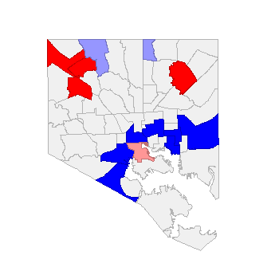
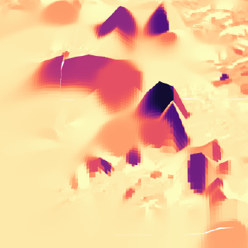
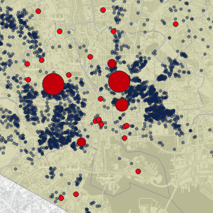
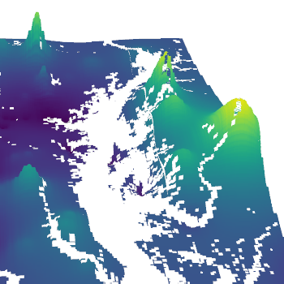

<!--This is the first row of projects -->
<div style="display:table-row; width:100%; table-layout: fixed">
<div style="display: table-cell; width:370px; margin-right:3px" markdown="1">

### Lab 6 



[See more details here.](https://github.com/ajbruninga/ajbruninga.github.io/blob/master/bruninga_lab_6/bruninga_lab6.md)

For this lab I looked at the correlation between population age and house size in areas in Baltimore City.

<small>__Tools__: GeoDa, Moran's I</small>

<small>__Data__: 
[Baltimore City Open GIS Data](http://gis-baltimore.opendata.arcgis.com/)</small>

</div>

<div style="display: table-cell; width:370px" markdown="1">

### Project 1



[See more details here.](https://github.com/ajbruninga/ajbruninga.github.io/blob/master/bruninga_project_1/bruninga_project_1.md)

The text below is smaller than the rest of this text. I used html tags for `small` and wrapped the text like this:

```html
<small>Text to *make* small.</small>
```

Notice I used markdown inside the html tags. 

<small>__Tools__: QGIS, 3D-mapping</small>

<small>__Data__:
[Baltimore City Open GIS Data](http://gis-baltimore.opendata.arcgis.com/)</small>

</div>
</div>
<!--This is the second row of projects -->
<div style="display:table-row; width:100%; table-layout: fixed">
<div style="display: table-cell; width:370px; margin-right:3px" markdown="1">

### Project 2 



[See more details here.](https://ajbruninga.github.io/bruninga_project_2/bruninga_project_2.md)

This project uses a 350px square image for the teaser image, but inside the square image, I used a circle to highlight a certain area. Pellentesque eget mauris vel mi tristique finibus vitae quis massa. Mauris vulputate, nulla vel tincidunt interdum, sem mauris scelerisque neque, suscipit pellentesque felis augue a erat. 

<small>__Tools__: QGIS, Interpolation, Photoshop

<small>__Data__: 
[Supportland](https://supportland.com/), [Oregon Craft Brew Guild](https://oregoncraftbeer.org/guild/)</small>

</div>

<div style="display: table-cell; width:370px" markdown="1">

### Project 3



[See more details here.](https://dillonma.github.io/project2_sfi/project2.html)

Phasellus consequat quam elit, et iaculis risus pellentesque aliquet. Proin ut enim dui. Ut elementum, purus nec rhoncus sagittis, nibh nunc auctor nulla, eu condimentum nisi velit eget magna. Nulla feugiat tincidunt dictum. Vestibulum congue sapien elit. Maecenas non sodales ligula, quis tempor mi. 

<small>__Tools__: QGIS, R

<small>__Data__:
[Census Streets](https://www.census.gov/cgi-bin/geo/shapefiles/index.php), US Business Directory (defunct)</small>

</div>
</div>

<!--This is just other markdown -->
